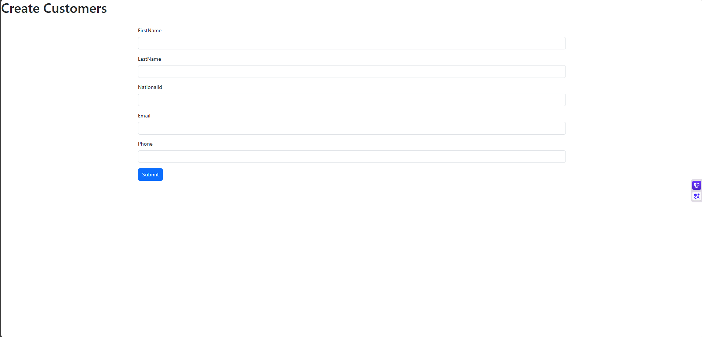
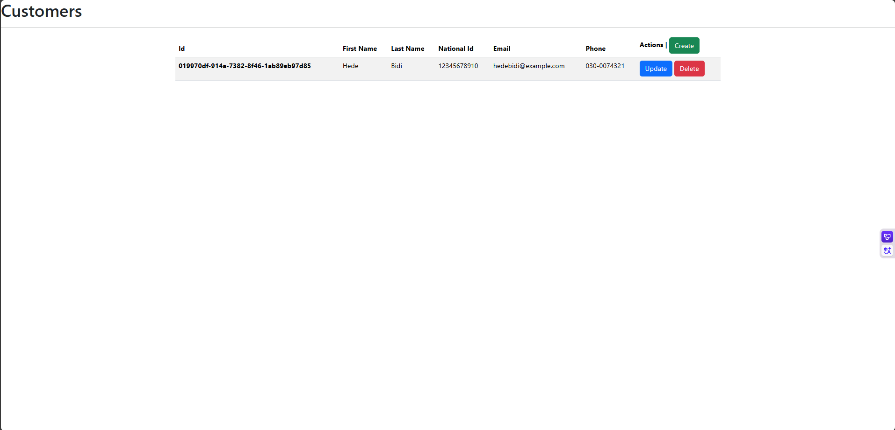
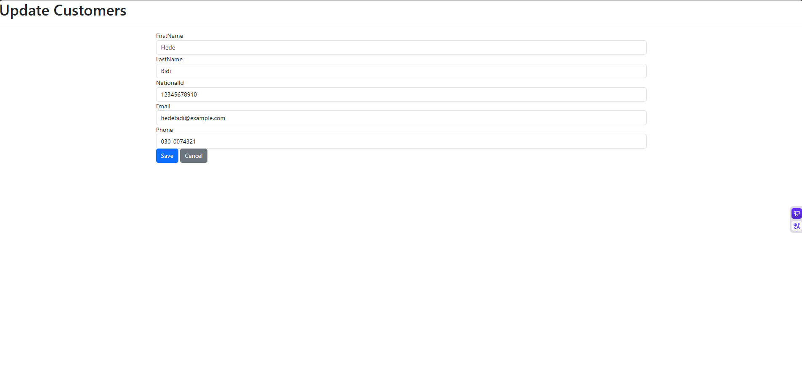
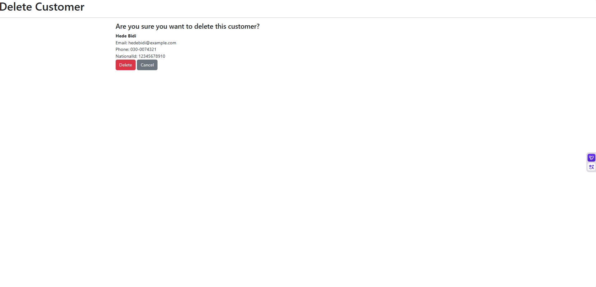

# 🚗 MVC Car Rental: A Car Rental Management System

**MVC Car Rental** is a comprehensive car rental management system developed using **ASP.NET MVC** and **Entity Framework**. This project provides a web-based solution for managing cars, customers, rental transactions, and users. It features integrated **FluentValidation** to enforce business rules and ensure data integrity.

---

## ✨ Key Features

* **Comprehensive Management:** Easily manage customers(Create,Read,Update and Delete)
* **Smart Search and Filtering:** Quickly search and filter cars by availability, category, and brand.
* **Role-Based Authorization:** Secure authentication and authorization for different user roles, such as administrators and customers.
* **Robust Data Validation:** Utilizes the **FluentValidation** library to guarantee consistent and secure data entry.
* **Clean Architecture:** An entity-based domain model following clean architecture principles.
* **User-Friendly Interface:** A simple and interactive user interface built with **Razor Views**.
* **Scalable Architecture:** A maintainable and scalable **ASP.NET MVC** architecture.

---

## 🛠️ Tech Stack

| Category | Technology | Description |
|---|---|---|
| **Framework** | ASP.NET MVC | Microsoft's popular Model-View-Controller framework for web applications. |
| **Language** | C# | The back-end logic of the project is written in C#. |
| **ORM** | Entity Framework | An Object-Relational Mapping (ORM) tool used for database operations. |
| **Validation** | FluentValidation | A library for building more readable and robust validation rules. |
| **Frontend** | Razor Views, HTML5, CSS3, JavaScript | Technologies used for the user interface and client-side interactions. |
| **Database** | Microsoft SQL Server | The relational database management system where all project data is stored. |
| **IDE** | Visual Studio 2022+ | The integrated development environment where the project is developed. |

---

## 📂 Entities (Domain Models)

The system is structured around the following main entities:

* **Car:** Represents vehicles available for rental. (e.g., Model, Brand, Daily Price, License Plate)
* **Customer:** Holds customer information. (e.g., Name, Email, Phone Number)
* **Rental:** Stores rental transactions and history. (e.g., Start/End Date, Total Amount)
* **User:** Manages application users (admins, customers, etc.).
* **Category:** Organizes cars by type. (e.g., Sedan, SUV, Hatchback)
* **Brand:** Specifies the brand of the cars. (e.g., BMW, Mercedes, Toyota)

---

## 🧾 Validation Layer

Validation rules are implemented with **FluentValidation** to guarantee consistent and secure data entry. Example validation rules include:

Validation rules are implemented with FluentValidation to guarantee consistent and secure data entry. Example validation rules include:

Customer Details: Validating the format of the name, email, and phone number.

---

## 📂 Project Structure

The project's main directory structure is as follows:
MVC_CarRental.sln           # Solution file
MVC_CarRental/              # Main ASP.NET MVC project
├── Controllers/            # Application controllers
├── Models/                 # Domain models (Car, Customer, Rental, etc.)
├── Validators/             # FluentValidation classes
├── Views/                  # Razor views (UI templates)
├── Scripts/                # JavaScript files
├── Content/                # CSS, images, and static assets
└── Web.config              # Project configuration

---

## 🚀 Getting Started

### Prerequisites

* Visual Studio 2022 (or later)
* .NET Framework 4.7.2+
* SQL Server

### Installation Steps

1.  Clone this repository to your local machine:
    ```bash
    git clone [https://github.com/dugerdev/MVC_CarRental.git](https://github.com/your-username/MVC_CarRental.git)
    ```
2.  Open the `MVC_CarRental.sln` file in Visual Studio.
3.  Restore NuGet packages:
    * `Tools > NuGet Package Manager > Restore Packages`
4.  Set up the database:
    * Update the SQL Server connection string in the `Web.config` file to match your database settings.
    * If using the Entity Framework Code First approach, run the necessary migrations.
5.  Build and run the project:
    * Press `Ctrl + F5` to start the application.

---

## 📸 Screenshots


---



---



---



## 🤝 Contributing

Contributions are welcome! If you'd like to contribute to this project, please follow these steps:

1.  Fork the repository.
2.  Create a new branch (`feature/new-feature`).
3.  Commit your changes.
4.  Push to the branch.
5.  Open a Pull Request.

---

## 📄 License

This project is licensed under the MIT License – see the `LICENSE` file for details.